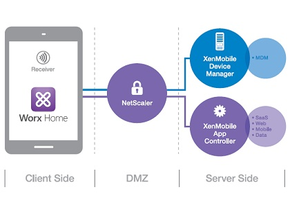

# mdm-user-guide

> Tip: Demo for Jennifer

## Intro

1.	Overview
2.	Implementation
3.	Device management specifications
4.	Use in the enterprise
5.	MDM for mobile security
6.	Additional MDM features
7.	SaaS versus on-premises solutions
8.	More on MDM, MAM and MEM
9.	See also
10. References
11. External links

# Overview [link](https://en.wikipedia.org/wiki/Mobile_device_management)

**MDM** is a way to ensure employees stay productive and do not breach corporate policies. Many organizations control activities of their employees using MDM products/services. MDM primarily deals with corporate data segregation, securing emails, securing corporate documents on devices, enforcing corporate policies, integrating and managing mobile devices including laptops and handhelds of various categories. MDM implementations may be either on-premises or cloud-based. Use commmand `code .` to call the windows.

```python
ubuntu@ubuntu-xenial:~/terraform-demo$ ip a
1: lo: <LOOPBACK,UP,LOWER_UP> mtu 65536 qdisc noqueue state UNKNOWN group default qlen 1
    link/loopback 00:00:00:00:00:00 brd 00:00:00:00:00:00
    inet 127.0.0.1/8 scope host lo
       valid_lft forever preferred_lft forever
    inet6 ::1/128 scope host 
       valid_lft forever preferred_lft forever
2: enp0s3: <BROADCAST,MULTICAST,UP,LOWER_UP> mtu 1500 qdisc pfifo_fast state UP group default qlen 1000
    link/ether 02:e9:3a:83:3e:e2 brd ff:ff:ff:ff:ff:ff
    inet 10.0.2.15/24 brd 10.0.2.255 scope global enp0s3
       valid_lft forever preferred_lft forever
    inet6 fe80::e9:3aff:fe83:3ee2/64 scope link 
       valid_lft forever preferred_lft forever
3: docker0: <NO-CARRIER,BROADCAST,MULTICAST,UP> mtu 1500 qdisc noqueue state DOWN group default 
    link/ether 02:42:73:7d:dc:fc brd ff:ff:ff:ff:ff:ff
    inet 172.17.0.1/16 scope global docker0
       valid_lft forever preferred_lft forever

```
### Infrastructure



Click here to [Download]()

|name|age|job|Des|
|---|---|---|---|
|Jude|37|IT|bad|
|Jenn|unknow| IT|good|